<div align="center">
    <a align="center" href="https://github.com/cakraawijaya" target="_blank"></a>
    <a align="center" href="https://scholar.google.co.id/citations?user=g3gskSsAAAAJ&hl=id/" target="_blank"></a>
    <a align="center" href="mailto:devancakra6@gmail.com" target="_blank"></a><br>
    <a align="center" href="https://www.linkedin.com/in/cakraawijaya" target="_blank"></a>
    <a align="center" href="https://www.medium.com/@cakraawijaya" target="_blank"></a>
    <a align="center" href="https://www.youtube.com/@cakraawijaya" target="_blank"></a>
    <a align="center" href="https://www.instagram.com/cakraa.wijaya" target="_blank"></a>
    <a align="center" href="https://www.tiktok.com/@cakraawijaya" target="_blank"></a>
</div>

<br>

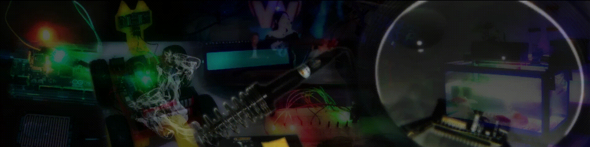

<br><br>

<h2 id="about" align="center">👤 About me</h2>
<div align="center">
    
 Hi everyone... &nbsp; You can call me <strong>``` Devan / Cakra ```</strong>, welcome to my Github.<br><br>I'm a <strong>``` Bachelor of Computer Science (S.Kom) ```</strong> from <strong>``` UPN Veteran Jatim ```</strong>.<br><br>I'm adaptable, like to learn new things, can work in a team or individually, & can solve problems.<br><br>My expertise: ``` Robotics & Embedded System ```, ``` Internet of Things ```, ``` Software Engineering ```.

</div>

<br><br>

<h2 id="basicknowledge" align="center">💻 Basic Knowledge Skills</h2>
<div align="center">
<details><summary>Some of the Programming Languages, Development Tools, and other things I've used for work.</summary><br>
    
<table align="center">
    <tr>
        <td align="center" width="96" height="96">
            <a href="#basicknowledge">
                
            </a><br>
            <p>C</p>
        </td>
        <td align="center" width="96" height="96">
            <a href="#basicknowledge">
                
            </a><br>
            <p>C++</p>
        </td><td align="center" width="96" height="96">
            <a href="#basicknowledge">
                
            </a><br>
            <p>VB 6</p>
        </td>
        <td align="center" width="96" height="96">
            <a href="#basicknowledge">
                
            </a><br>
            <p>Javascript</p>
        </td>
        <td align="center" width="96" height="96">
            <a href="#basicknowledge">
                
            </a><br>
            <p>PHP</p>
        </td>
        <td align="center" width="96" height="96">
            <a href="#basicknowledge">
                
            </a><br>
            <p>SQL</p>
        </td>
        <td align="center" width="96" height="96">
            <a href="#basicknowledge">
                
            </a><br>
            <p>Python</p>
        </td>
        <td align="center" width="96" height="96">
            <a href="#basicknowledge">
                
            </a><br>
            <p>MicroPython</p>
        </td>
    </tr>
    <tr>
        <td align="center" width="96" height="96">
            <a href="#basicknowledge">
                
            </a><br>
            <p>VS Code</p>
        </td>
        <td align="center" width="96" height="96">
            <a href="#basicknowledge">
                
            </a><br>
            <p>Git</p>
        </td>
        <td align="center" width="96" height="96">
            <a href="#basicknowledge">
                
            </a><br>
            <p>MySQL</p>
        </td>
        <td align="center" width="96" height="96">
            <a href="#basicknowledge">
                
            </a><br>
            <p>MariaDB</p>
        </td>
        <td align="center" width="96" height="96">
            <a href="#basicknowledge">
                
            </a><br>
            <p>MongoDB</p>
        </td>
        <td align="center" width="96" height="96">
            <a href="#basicknowledge">
                
            </a><br>
            <p>Firebase</p>
        </td>
        <td align="center" width="96" height="96">
            <a href="#basicknowledge">
                
            </a><br>
            <p>Composer</p>
        </td>
        <td align="center" width="96" height="96">
            <a href="#basicknowledge">
                
            </a><br>
            <p>Ngrok</p>
        </td>
    </tr>
    <tr>
        <td align="center" width="96" height="96">
            <a href="#basicknowledge">
                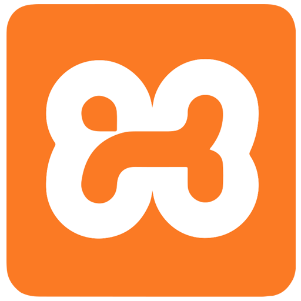
            </a><br>
            <p>Xampp</p>
        </td>
        <td align="center" width="96" height="96">
            <a href="#basicknowledge">
                
            </a><br>
            <p>Laragon</p>
        </td>
        <td align="center" width="96" height="96">
            <a href="#basicknowledge">
                
            </a><br>
            <p>Apache</p>
        </td> 
        <td align="center" width="96" height="96">
            <a href="#basicknowledge">
                
            </a><br>
            <p>Docker</p>
        </td>
        <td align="center" width="96" height="96">
            <a href="#basicknowledge">
                
            </a><br>
            <p>MQTTX</p>
        </td>
        <td align="center" width="96" height="96">
            <a href="#basicknowledge">
                
            </a><br>
            <p>Bootstrap</p>
        </td>
        <td align="center" width="96" height="96">
            <a href="#basicknowledge">
                
            </a><br>
            <p>Tailwind</p>
        </td>
        <td align="center" width="96" height="96">
            <a href="#basicknowledge">
                
            </a><br>
            <p>Font Awesome</p>
        </td>
    </tr>
    <tr>      
        <td align="center" width="96" height="96">
            <a href="#basicknowledge">
                
            </a><br>
            <p>CodeIgniter</p>
        </td>
        <td align="center" width="96" height="96">
            <a href="#basicknowledge">
                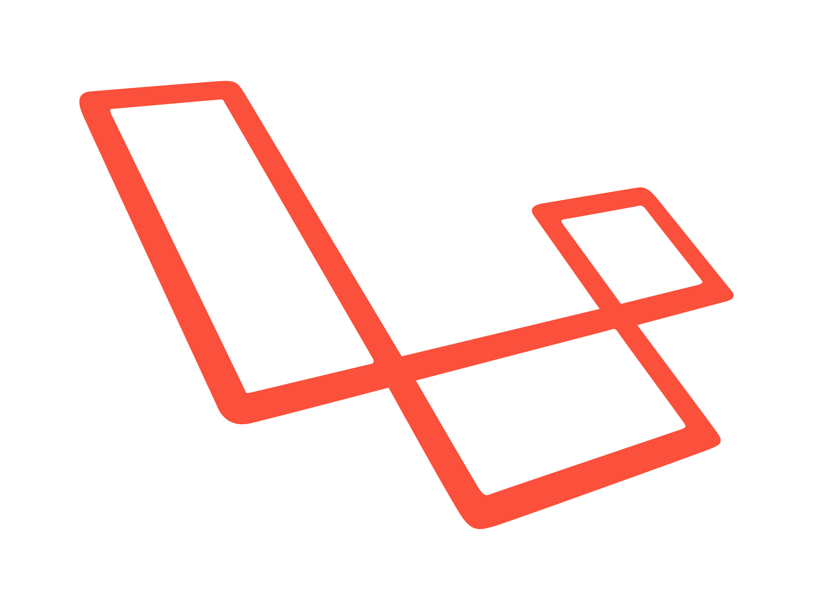
            </a><br>
            <p>Laravel</p>
        </td>
        <td align="center" width="96" height="96">
            <a href="#basicknowledge">
                
            </a><br>
            <p>Node JS</p>
        </td>
        <td align="center" width="96" height="96">
            <a href="#basicknowledge">
                
            </a><br>
            <p>Express JS</p>
        </td>
        <td align="center" width="96" height="96">
            <a href="#basicknowledge">
                
            </a><br>
            <p>React JS</p>
        </td>
        <td align="center" width="96" height="96">
            <a href="#basicknowledge">
                
            </a><br>
            <p>Vue JS</p>
        </td> 
        <td align="center" width="96" height="96">
            <a href="#basicknowledge">
                
            </a><br>
            <p>Botman</p>
        </td>
        <td align="center" width="96" height="96">
            <a href="#basicknowledge">
                
            </a><br>
            <p>PlatformIO</p>
        </td>
    </tr>
    <tr>
        <td align="center" width="96" height="96">
            <a href="#basicknowledge">
                
            </a><br>
            <p>Kodular</p>
        </td>
        <td align="center" width="96" height="96">
            <a href="#basicknowledge">
                
            </a><br>
            <p>MIT App Inventor</p>
        </td>
        <td align="center" width="96" height="96">
            <a href="#basicknowledge">
                
            </a><br>
            <p>Twilio</p>
        </td>
        <td align="center" width="96" height="96">
            <a href="#basicknowledge">
                
            </a><br>
            <p>Fonnte</p>
        </td>
        <td align="center" width="96" height="96">
            <a href="#basicknowledge">
                
            </a><br>
            <p>Telegram</p>
        </td>
        <td align="center" width="96" height="96">
            <a href="#basicknowledge">
                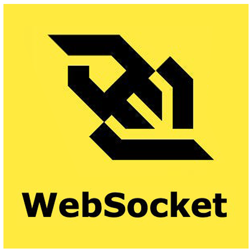
            </a><br>
            <p>WebSocket</p>
        </td>
        <td align="center" width="96" height="96">
            <a href="#basicknowledge">
                
            </a><br>
            <p>Blynk IoT</p>
        </td>
        <td align="center" width="96" height="96">
            <a href="#basicknowledge">
                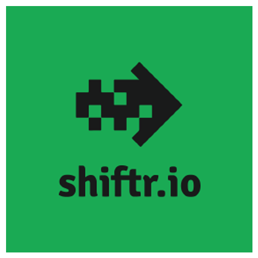
            </a><br>
            <p>Shiftr.io</p>
        </td>
    </tr>
    <tr>     
        <td align="center" width="96" height="96">
            <a href="#basicknowledge">
                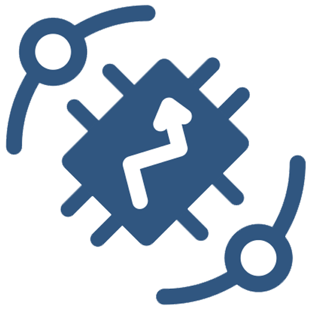
            </a><br>
            <p>ThingsBoard</p>
        </td>
        <td align="center" width="96" height="96">
            <a href="#basicknowledge">
                
            </a><br>
            <p>Ubidots</p>
        </td>
        <td align="center" width="96" height="96">
            <a href="#basicknowledge">
                
            </a><br>
            <p>Thingspeak</p>
        </td>
        <td align="center" width="96" height="96">
            <a href="#basicknowledge">
                
            </a><br>
            <p>Mosquitto</p>
        </td>   
        <td align="center" width="96" height="96">
            <a href="#basicknowledge">
                
            </a><br>
            <p>io-t.net</p>
        </td>
        <td align="center" width="96" height="96">
            <a href="#basicknowledge">
                
            </a><br>
            <p>Antares</p>
        </td>
        <td align="center" width="96" height="96">
            <a href="#basicknowledge">
                
            </a><br>
            <p>Node Red</p>
        </td>  
        <td align="center" width="96" height="96">
            <a href="#basicknowledge">
                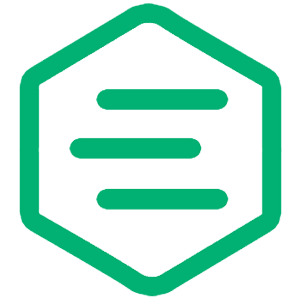
            </a><br>
            <p>EMQX</p>
        </td>  
    </tr>
    <tr>     
        <td align="center" width="96" height="96">
            <a href="#basicknowledge">
                
            </a><br>
            <p>HiveMQ</p>
        </td>
        <td align="center" width="96" height="96">
            <a href="#basicknowledge">
                
            </a><br>
            <p>Thinger.io</p>
        </td>  
        <td align="center" width="96" height="96">
            <a href="#basicknowledge">
                
            </a><br>
            <p>Arduino</p>
        </td>
        <td align="center" width="96" height="96">
            <a href="#basicknowledge">
                
            </a><br>
            <p>Atmel</p>
        </td>
        <td align="center" width="96" height="96">
            <a href="#basicknowledge">
                
            </a><br>
            <p>Espressif</p>
        </td>
        <td align="center" width="96" height="96">
            <a href="#basicknowledge">
                
            </a><br>
            <p>STM</p>
        </td>
        <td align="center" width="96" height="96">
            <a href="#basicknowledge">
                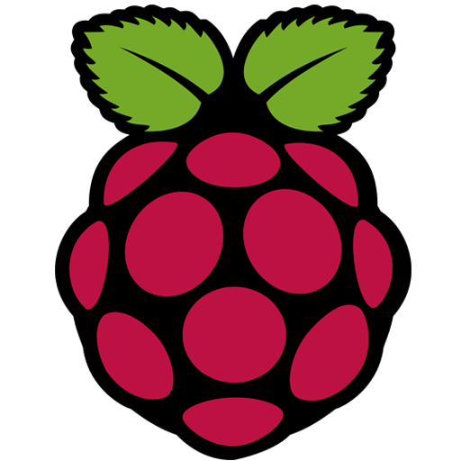
            </a><br>
            <p>Raspberry</p>
        </td>
        <td align="center" width="96" height="96">
            <a href="#basicknowledge">
                
            </a><br>
            <p>Autodesk Eagle</p>
        </td>
    </tr>
    <tr>      
        <td align="center" width="96" height="96">
            <a href="#basicknowledge">
                
            </a><br>
            <p>EasyEDA</p>
        </td>
        <td align="center" width="96" height="96">
            <a href="#basicknowledge">
                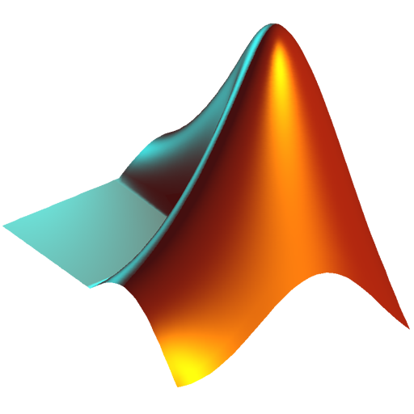
            </a><br>
            <p>Matlab</p>
        </td>
        <td align="center" width="96" height="96">
            <a href="#basicknowledge">
                
            </a><br>
            <p>Google Apps Script</p>
        </td>  
        <td align="center" width="96" height="96">
            <a href="#basicknowledge">
                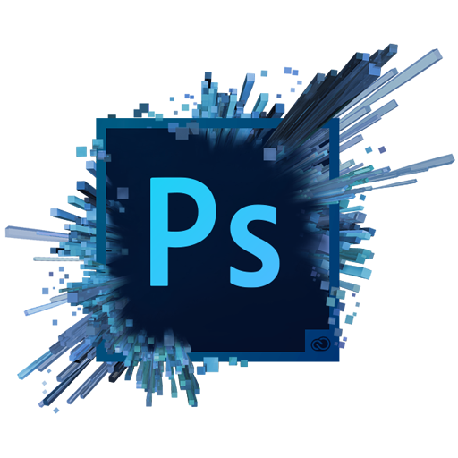
            </a><br>
            <p>Adobe Photoshop</p>
        </td>
    </tr>
</table>
</div>
</details>

<br><br>

<h2 id="sosmedandacademicrecords" align="center">♻️ My Community</h2>
<div id="community" align="center">
  <a align="center" href="https://www.instagram.com/robotics.upnjatim/" target="_blank">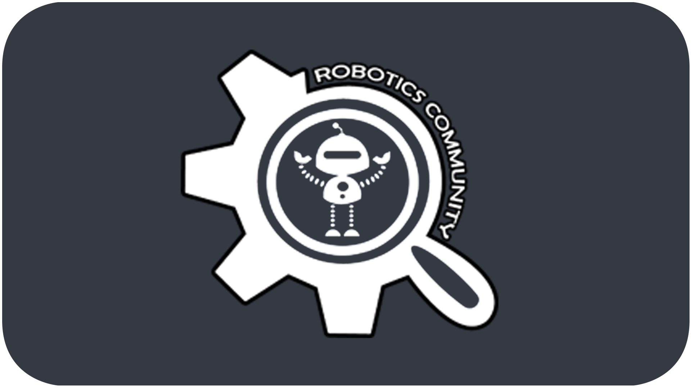</a>
  <a align="center" href="https://digitalent.kominfo.go.id/" target="_blank"></a>
  <a align="center" href="https://edspert.id/" target="_blank"></a>
  <a align="center" href="https://www.dicoding.com/" target="_blank"></a>
  <a align="center" href="https://nusabot.id/" target="_blank"></a>
  <br>
  <a align="center" href="https://www.youtube.com/channel/UCkTp-v7MD7C6rYnjsU0bBWg" target="_blank">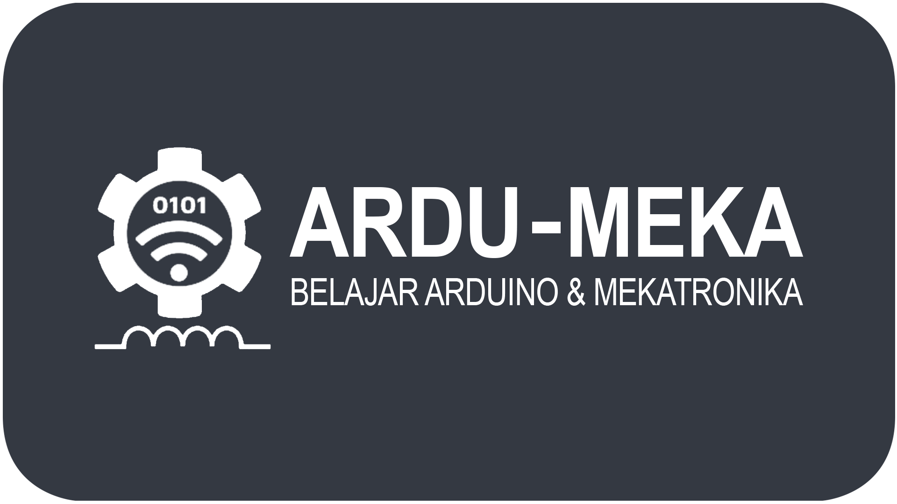</a>
  <a align="center" href="https://indobot.co.id/" target="_blank"></a>
  <a align="center" href="https://progate.com/" target="_blank">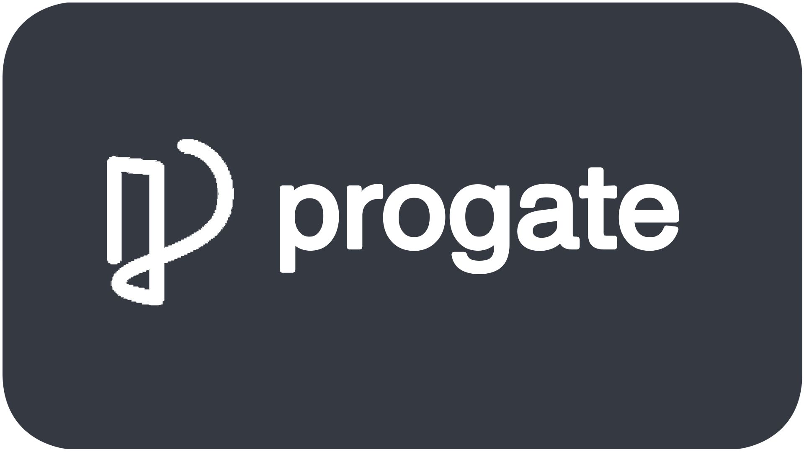</a>
  <a align="center" href="https://www.ics-cademy.com/" target="_blank">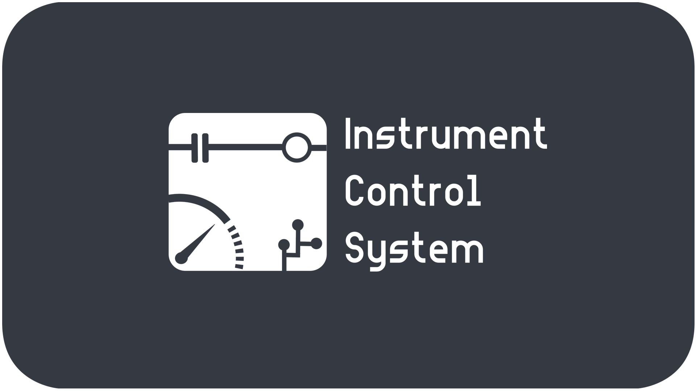</a>
  <a align="center" href="https://kelasiot.id/" target="_blank">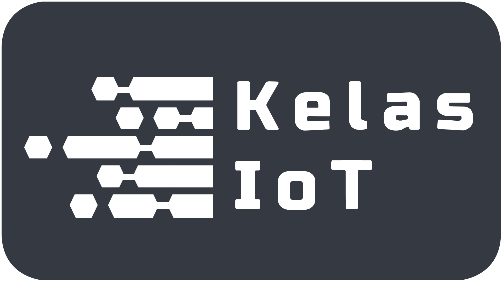</a>
</div><br><br><br>

<div class="container" id="githubstats" align="center">
  &nbsp;&nbsp;&nbsp;&nbsp;
      
  
</div>
